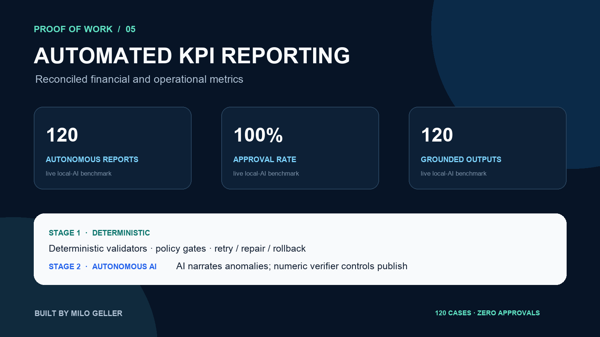

# Autonomous Business KPI Reporting



[](https://github.com/Milo318/automated-business-reporting-poc/actions/workflows/ci.yml)

A proof of concept that combines payment, customer, lead, and support-ticket data into a decision-ready HTML report. Financial calculations reconcile against the input ledger, operational KPIs are repeatable, and AI can optionally narrate already-locked metrics.

**Public repository:** https://github.com/Milo318/automated-business-reporting-poc

> **Data notice:** every payment, company, lead, and support ticket is fictional mock data. The generated report visibly carries the same disclosure.

## Autonomous AI proof

The upgraded workflow calculates KPI changes deterministically, selects the primary anomaly, and asks a live model to produce a grounded narrative. A numeric verifier checks the selected metric, direction, previous value, and current value before automatic publication. Failed grounding is replaced with a deterministic verified statement rather than sent for approval.

The committed [live-model benchmark](proof/autonomous-benchmark.json) and [120 case-level publication decisions](proof/autonomous-cases.jsonl) were generated with `granite4.1:3b` through Ollama:

| Autonomous acceptance check | Result |
|---|---:|
| Reporting periods | 120 |
| Raw AI narratives correctly grounded | 119 / 120 |
| Automatic self-repairs | 1 |
| Grounded publications | 120 / 120 |
| Approval rate | **100%** |
| Human approvals | **0** |

```bash
python -m business_reporting.autonomous_benchmark --cases 120 --model granite4.1:3b
```

Reproduction requires a running Ollama service with the selected model installed.

AI does not calculate the KPIs or choose arbitrary facts. The deterministic layer supplies the primary metric, and publication is allowed only when every numeric claim matches the locked dataset.

## Proof of work

The [committed benchmark](proof/benchmark.json) repeats the full metric calculation 500 times:

| Check | Measured result |
|---|---:|
| Calculation runs | 500 |
| Identical metric snapshots | 100% |
| Gross revenue / refunds | €14,950 / €300 |
| Reported net revenue | €14,650 |
| Independent ledger sum | €14,650 |
| Reconciliation difference | €0.00 |
| Automated tests | 7 passing |

The exact business snapshot also includes MRR, new customers, churn, lead conversion, resolved tickets, and SLA compliance. Repetition proves deterministic calculation; synthetic inputs mean these figures are demonstrations rather than business claims.

### Reproduce the evidence

```bash
python3 -m venv .venv
source .venv/bin/activate
python -m pip install -e .
python -m unittest discover -s tests -v
python -m business_reporting.cli
python -m business_reporting.benchmark --runs 500
```

Open `output/report.html` in any browser. The source KPI payload and reconciliation result are stored in `output/metrics.json`.

## How it works

```text
Payments + customers + leads + tickets
                  ↓
Schema-specific loaders
                  ↓
Decimal financial math + operational KPI rules
                  ↓
Independent ledger reconciliation
                  ↓
Responsive HTML report + machine-readable JSON
                  ↓ optional
Grounded AI executive narrative
```

### Stage 1 — deterministic core

Financial values use decimal arithmetic, and net revenue is cross-checked against the ledger sum. Lead conversion and SLA compliance have explicit denominators. The same inputs produce the same metric payload and report on every run.

### Stage 2 — autonomous grounded publication

With `--ai`, a model receives locked KPIs and the deterministically detected primary anomaly. The numeric verifier either publishes the grounded narrative or replaces it with a verified deterministic statement. No approval queue is required.

```bash
export LLM_API_KEY="..."
python -m business_reporting.cli --ai
```

[`SCHEDULING.md`](SCHEDULING.md) shows how to run the same command from cron or a scheduled workflow.

## Evidence map

- [`data/mock/`](data/mock/) — four labeled synthetic operational datasets
- [`tests/test_reporting.py`](tests/test_reporting.py) — financial, operational, and HTML-output assertions
- [`proof/benchmark.json`](proof/benchmark.json) — replay and reconciliation evidence
- [`proof/autonomous-benchmark.json`](proof/autonomous-benchmark.json) — live-model publication summary
- [`proof/autonomous-cases.jsonl`](proof/autonomous-cases.jsonl) — all 120 publication decisions
- [`proof/portfolio-card.png`](proof/portfolio-card.png) — portfolio-ready evidence image
- [GitHub Actions workflow](.github/workflows/ci.yml) — repeatable checks on every push

## Production extension points

A real deployment would connect accounting, CRM, and support APIs; add freshness checks; persist historical snapshots; notify on failed reconciliation; and publish through the client's preferred scheduler and access controls.

Built by **Milo Geller** · MIT licensed.
